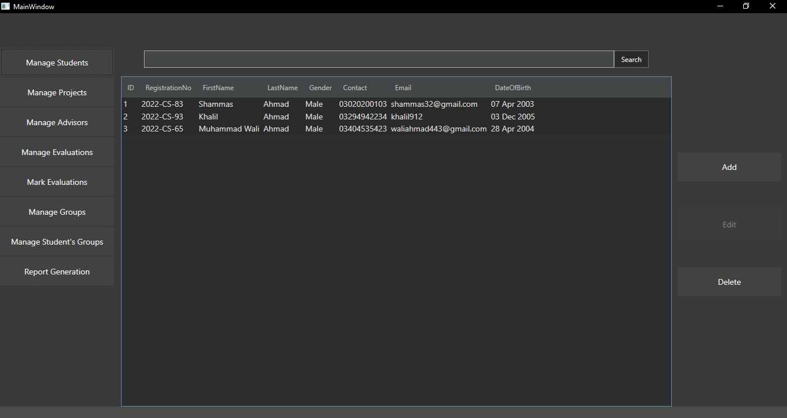
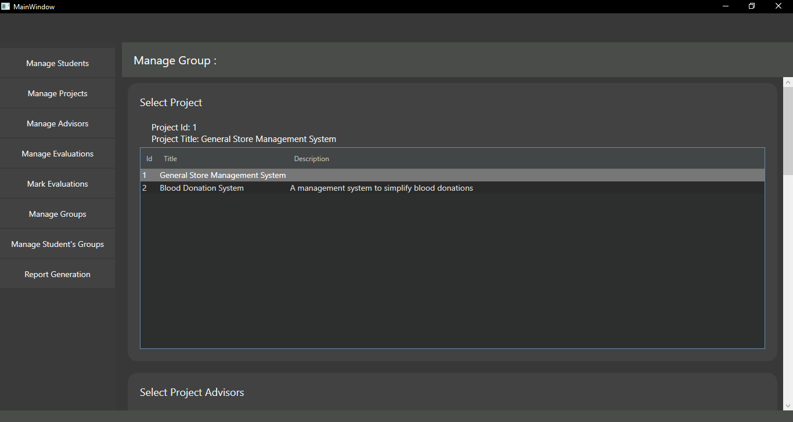

# FYP-Management-System
This project is part of Database Systems course mid term project.
## Project Screenshots



## Technology Stack
- C# .NET 6
- Windows Presentation Foundation (WPF)
## Nuget Packages Used
- iTextSharp 5.5.13.0
- Microsoft.Data.SqlClient 5.2.0
## Compilation
Clone this repository:
```
git clone https://github.com/sma02/FYP-Management-System.git
```
open 'ProjectADBScript.sql' in Microsoft SQL Server Management Studio(SSMS) and execute to create the database.
